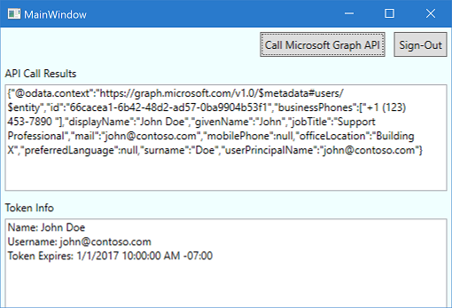

> This sample is for MSAL 4.x, if you are interested in the same code for MSAL 2.x, look at the [releases](https://github.com/Azure-Samples/active-directory-dotnet-desktop-msgraph-v2/releases) tab or the [previousVersions/Msal2x](https://github.com/Azure-Samples/active-directory-dotnet-desktop-msgraph-v2/tree/previousVersions/Msal2x) branch

# WPF application signing in users with Microsoft and calling the Microsoft Graph

| [Getting Started](https://docs.microsoft.com/azure/active-directory/develop/guidedsetups/active-directory-mobileanddesktopapp-windowsdesktop-intro)| [Library](https://github.com/AzureAD/microsoft-authentication-library-for-dotnet/wiki) | [Docs](https://aka.ms/aadv2) | [Support](README.md#community-help-and-support) 
| --- | --- | --- | --- |

This simple sample demonstrates how to use the [Microsoft Authentication Library (MSAL) for .NET](https://github.com/AzureAD/microsoft-authentication-library-for-dotnet) to get an access token and call the Microsoft Graph (using OAuth 2.0 against the Microsoft identity platform endpoint).


## Steps to Run

You can get full explanation about this sample, and build it from scratch by going to [Windows desktop .NET guided walkthrough](https://docs.microsoft.com/azure/active-directory/develop/guidedsetups/active-directory-mobileanddesktopapp-windowsdesktop-intro).



This sample is pre-configured. If you just want to quickly run it just:

1. Clone the code.
```
  git clone https://github.com/Azure-Samples/active-directory-dotnet-desktop-msgraph-v2.git
```

2.  Run the application from Visual Studio (Debug | Start without Debugging)

### [Optional] Use your own application coordinates

If you want to use your own application coordinates, please follow these instructions:

#### Choose the Azure AD tenant where you want to create your applications

1. Sign in to the [Azure portal](https://portal.azure.com) using either a work or school account or a personal Microsoft account.
1. If your account gives you access to more than one tenant, select your account in the top right corner, and set your portal session to the desired Azure AD tenant
   (using **Switch Directory**).
1. In the left-hand navigation pane, select the **Azure Active Directory** service, and then select **App registrations**.

#### Register the client app (WpfApp)

1. Navigate to the Microsoft identity platform for developers [App registrations](https://go.microsoft.com/fwlink/?linkid=2083908) page.
1. Select **New registration**.
   - In the **Name** section, enter a meaningful application name that will be displayed to users of the app, for example `WpfApp`.
   - In the **Supported account types** section, select **Accounts in any organizational directory and personal Microsoft accounts (e.g. Skype, Xbox, Outlook.com)**.
    - Select **Register** to create the application.
1. On the app **Overview** page, find the **Application (client) ID** value and record it for later. You'll need it to configure the Visual Studio configuration file for this project.
1. In the list of pages for the app, select **Authentication**.
  1. In the **Redirect URIs** list, under **Suggested Redirect URIs for public clients (mobile, desktop)** be sure to add https://login.microsoftonline.com/common/oauth2/nativeclient.
   1. Select **Save**.
1. Configure Permissions for your application. To that extent in the list of pages click on **API permissions**
   - click the **Add a permission** button and then,
   - Ensure that the **Microsoft APIs** tab is selected
   - In the *Commonly used Microsoft APIs* section, click on **Microsoft Graph**
   - In the **Delegated permissions** section, ensure that the right permissions are checked: **User.Read**. Use the search box if necessary.

#### Configure the code to use your application's coordinates

1. Open the `active-directory-wpf-msgraph-v2\App.xaml.cs` file
1. Find the app key `ClientId` and replace the existing value with the application ID (clientId) of the `WpfApp` application copied from the Azure portal.
1. If connecting to a national cloud, open the 'active-directory-wpf-msgraph-v2\MainWindow.xaml.cs' file and update string `graphAPIEndpoint` to the appropriate endpoint. [See a list of national cloud Graph enpoints here.](https://docs.microsoft.com/en-us/graph/deployments#microsoft-graph-and-graph-explorer-service-root-endpoints)
1. Run the application from Visual Studio (Debug | Start without Debugging)

## Community Help and Support

We use [Stack Overflow](http://stackoverflow.com/questions/tagged/msal) with the community to provide support. We highly recommend you ask your questions on Stack Overflow first and browse existing issues to see if someone has asked your question before. Make sure that your questions or comments are tagged with [msal.dotnet].

If you find a bug in the sample please raise the issue on [GitHub Issues](../../issues).

If you find a bug in msal.Net, please raise the issue on [MSAL.NET GitHub Issues](https://github.com/AzureAD/microsoft-authentication-library-for-dotnet/issues).

To provide a recommendation, visit our [User Voice page](https://feedback.azure.com/forums/169401-azure-active-directory).

- Developers who wish to gain good familiarity of programming for Microsoft Graph are advised to go through the [An introduction to Microsoft Graph for developers](https://www.youtube.com/watch?v=EBbnpFdB92A) recorded session.

## Contributing

If you'd like to contribute to this sample, see [CONTRIBUTING.MD](/CONTRIBUTING.md).

This project has adopted the [Microsoft Open Source Code of Conduct](https://opensource.microsoft.com/codeofconduct/). For more information see the [Code of Conduct FAQ](https://opensource.microsoft.com/codeofconduct/faq/) or contact [opencode@microsoft.com](mailto:opencode@microsoft.com) with any additional questions or comments.

## More information
For more information see MSAL.NET's conceptual documentation:
- [Quickstart: Register an application with the Microsoft identity platform](https://docs.microsoft.com/en-us/azure/active-directory/develop/quickstart-register-app)
- [Quickstart: Configure a client application to access web APIs](https://docs.microsoft.com/en-us/azure/active-directory/develop/quickstart-configure-app-access-web-apis)
- [Recommended pattern to acquire a token in public client applications](https://github.com/AzureAD/microsoft-authentication-library-for-dotnet/wiki/AcquireTokenSilentAsync-using-a-cached-token#recommended-call-pattern-in-public-client-applications)
- [Acquiring tokens interactively in public client applications](https://github.com/AzureAD/microsoft-authentication-library-for-dotnet/wiki/Acquiring-tokens-interactively) 
- [Customizing Token cache serialization](https://github.com/AzureAD/microsoft-authentication-library-for-dotnet/wiki/token-cache-serialization)
